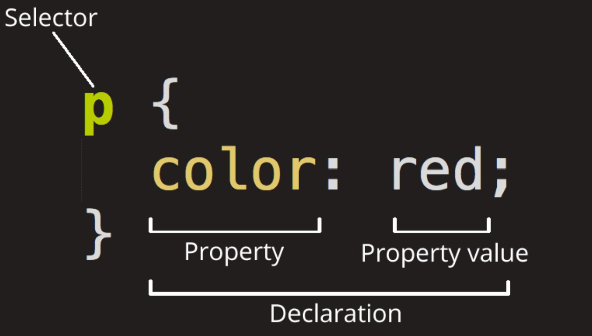
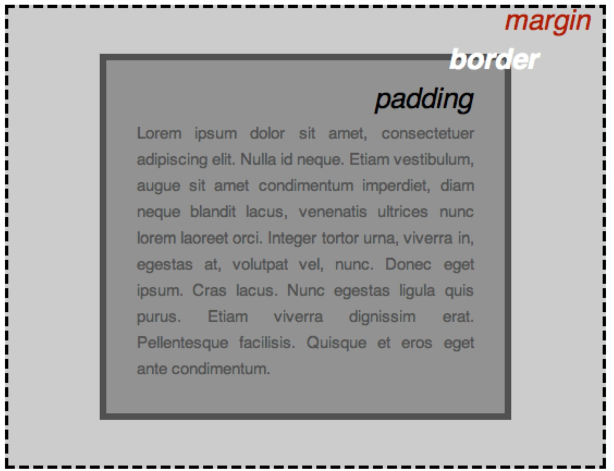

Cascading Style Sheets è il codice che definisce lo stile del contenuto web.

## Come funziona
Crea una directory Styles nel root del tuo sito e, al suo interno crea un file style.css.<br>Il file contiene gli stili della nostra pagina web index.html.
Per far funzionare il codice, dobbiamo collegare style.css alla pagina index.html, altrimenti lo stile non cambierà l'aspetto dell'HTML. 
Dobbiamo scrivere questo codice nella file index
```
<link href="styles/style.css" rel="stylesheet" />
```

## Anatomia CSS


Selettore<br>
Questo è il nome dell'elemento HTML da formattare, in questo esempio ```<p></p>```

Dichiarazione<br>
Questa è la regola composta da:

* Proprietà
Questi sono i modi in cui è possibile definire lo stile di un elemento.

* Valore della proprietà
Definisce l'aspetto della proprietà.

Le altre parti importanti della sintassi sono:

1) le parentesi graffe. '{ }'<br>
2) i due punti  ':' per separare la proprietà<br>
3) il punto e virgola ';' per separare ogni dichiarazione da quella successiva.

Esempio di codice

Codice con più proprietà

```
p {
  color: red;
  width: 500px;
  border: 1px solid black;
}
```
Codice con più elementi

```
p,
li,
h1 {
  color: red;
}
```
## Padding

Il layout CSS si basa principalmente sul box model.




1) padding, lo spazio attorno al contenuto. 
2) border, la linea continua appena fuori dal contenuto
3) margin, lo spazio attorno al bordo esterno.

### Attributi del padding

```background-color```, il colore dietro il contenuto e la spaziatura di un padding.

```color```, il colore del contenuto di un padding (solitamente testo).
[The color picker](https://developer.mozilla.org/en-US/docs/Web/CSS/CSS_colors/Color_picker_tool
)

```width``` larghezza di un paddingin %

```heigh``` altezza di un padding in pixel

```position``` fixed, posizione fissa quando muovo la pagina del padding.

```padding``` definisce lo spazio interno di un elemento.
[Padding](https://developer.mozilla.org/en-US/docs/Web/CSS/padding#syntax)

```margin``` definisce lo spazio esterno di un elemento.

```position``` definisce la posizione del padding nella pagina.
  * static segue il fluzzo normale del documento
  * relative segue il flusso normale del documento ma può essere spostato con le proprietà  ```top, right, bottom, left```
  * absolute rimosso dal flusso normale del documento, è posizionato rispetto al suo antenato più prossimo.
  * fixed rimane visibile quando scorre la pagina
  * sticky si attacca al documento  quanado si scorre la pagina


#### Link
[Mdn](https://developer.mozilla.org/en-US/docs/Learn/Getting_started_with_the_web/CSS_basics)