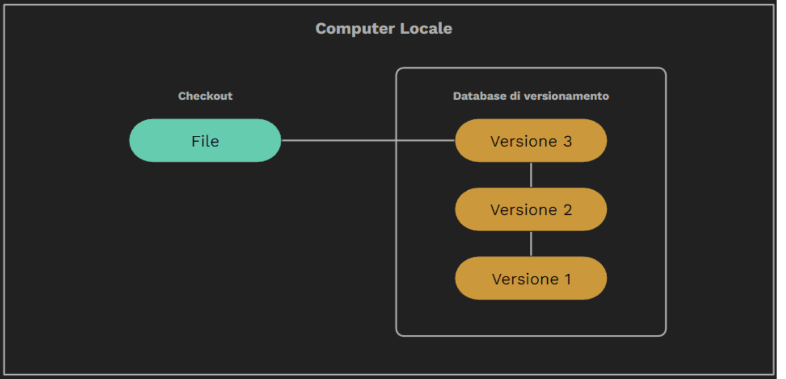
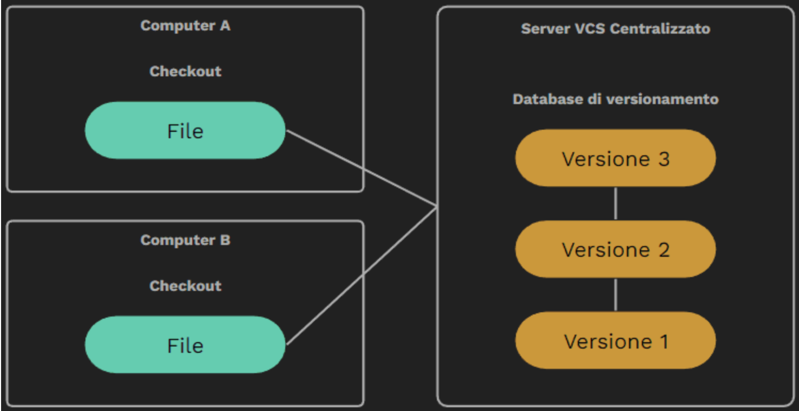
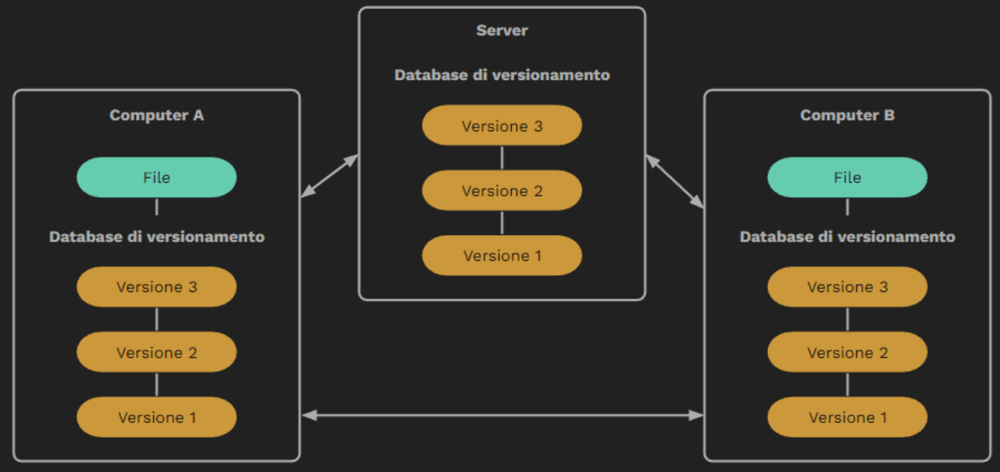
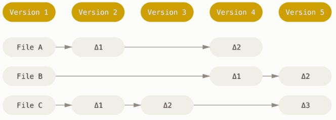
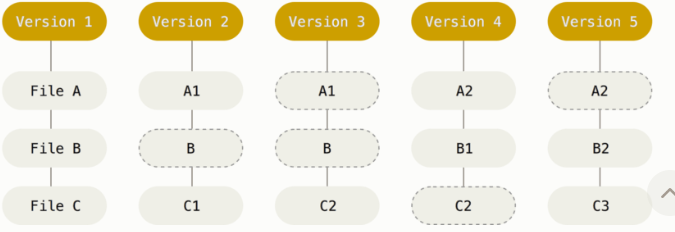
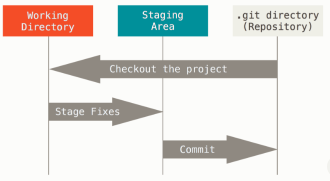

# VCS o controllo di versione
Sistema che registra nel tempo, i cambiamenti d un file o serier di file, cosi da poter richiamare una specifica versione in un secondo momento.

## Le funzionalità principali di un VCS

* Cronologia completa delle modifiche di un file (creazione, cancellazione, modifica, spostamento e cancellazione). Ognuna di queste è accompagnata da ulteriori informazioni come autore, data e note sulla modifica.
* Possibilità di divergere e lavorare in flussi di modifiche isolati, chiamati rami.  Questa funzionalità è nota come branching o ramificazione.
* I flussi isolati possono essere riunificati in qualsiasi momento al flusso principale. Questo si chiama merging o unificazione.
* Verifica e segnalazione preventiva dei conflitti così da evitare di portare dei malfunzionamenti inattesi nel flusso principale.
* Nel caso di errore si può “tornare indietro” ad una versione precedente, correggendo l’errore ed evitando malfunzionamenti prolungati.

## Tipologie di VCS

* Locali

* Centralizzati

* Distribuiti
  

## VCS Git

I vecchi VCS salvano l’informazione come una lista di modifiche ai file.

Git considera i propri dati più come una sequenza di istantanee (snapshot).
Git, ogni volta che registra **fai  il commit**,  fa un’immagine di tutti i file in quel momento, salvando un riferimento allo **snapshot**. Per essere efficiente, se alcuni file non sono cambiati, Git non li risalva, ma crea semplicemente un collegamento al file precedente già salvato.

Ogni *snapshot o commit* crea un  hash univoco + checksum di controllo integrità dei file.

## Hash SHA 1 e checksum

Qualsiasi cosa in Git è controllata.  Il meccanismo che Git usa per fare il commit è una hash SHA-1. Si tratta di una stringa di 40-caratteri, composta da caratteri esadecimali (0–9 ed a–f) e calcolata in base al contenuto dei file o della struttura della directory in Git.  Un hash SHA-1 assomiglia a qualcosa come: 
***24b9da6552252987aa493b52f8696cd6d3b00373*** 

L'hash contiene un checksum. Questo significa che è impossibile cambiare il contenuto di qualsiasi file o directory senza che Git lo sappia.

# Le aree di lavoro di Git

Le aree di Git sono tre e sono:

1. La Working Directory dove risiede il codice sorgente nella sua versione più recente. Corrisponde alla cartella nel nostro computer, quella che apriamo nel nostro editor per lavorare.

2. La Staging Area, area fittizia, non esiste veramente, qui è dove i file vengono contrassegnati per essere inclusi nella commit successiva.

3. La Git Directory, lo spazio, nel database dove i file vengono salvati e custoditi.

## Gli stati dei file

I file del nostro progetto possono cambiare di stato.  Git infatti ce li contrassegnerà in modo differente in base a delle specifiche situazioni, come:

1  Senza traccia (Untracked): il file è stato creato nella working directory  ma non è stato mai oggetto di commit o inserito in staging area.
2 Senza storia (Staged): il file è stato aggiunto per la prima volta alla staging area, 
3 Modificato (Modified): Il file è stato  committato e successivamente modificato nella working directory. Non corrisponde al file committato.
 4 Committed: Il file è stato salvato nella git directory e quello presente in working directory è identico.
 
## Il workflow di base in Git

1. Modifica o creazione di file nella Working Directory
2. Inserimento dei file nalla staging area 
3. Commit dei file presenti  nell’area di stage, ovvero fa un istantanea dei file presenti nell'area di stage e crea collegamenti ai file non modificati del commit dove stiamo lavorando. L'istantanea viene salvata nella .git directory 'repository' con un suo hash che la rende univoca.
4. Push 'dal repo locale al repo remoto'  o Pull 'dal repo remoto al repo locale' a seconda di dove abbiamo lavorato.

