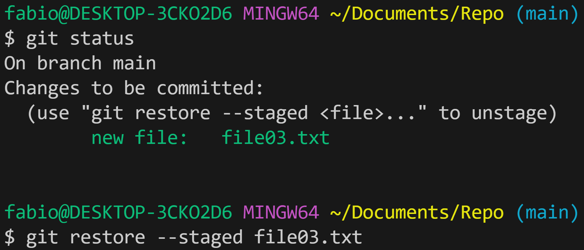

[Git Basics Getting a Repository](https://git-scm.com/book/en/v2/Git-Basics-Getting-a-Git-Repository#ch02-git-basics-chapter)

## Prima configurazione di Git

Ci sono molti modi diversi di usare Git. 
***La riga di comando è l’unico posto dove puoi eseguire tutti i comandi di Git.*** 

Git viene fornito con uno strumento chiamato ***git config*** che ti consente di ottenere e impostare variabili di configurazione che controllano tutti gli aspetti e il funzionamento di Git.
Puoi visualizzare tutte le tue impostazioni e la loro provenienza utilizzando:

*$ git config --list --show-origin*

#### Impostare il nome utente e indirizzo email. 

*$ git config --global user.name "John Doe"*

*$ git config --global user.email johndoe@example.com*

Le credenziali impostate con --global Git verranno usate per ogni Repository.
Si può eseguire lo stesso comando nella directory di progetto omettendo il flag --global

##### Scegliere l’editor predefinito 

$ git config --global core.editor nome-editor

#### Configurare il nome della branch iniziale

Di default il nome è main, ma volendo impostare un nome diverso bisognerà eseguire il comando:

$ git config --global init.defaultBranch nome branch

Per controllare le impostazioni di configurazione, si usa

*$ git config --list*

Mentre per visualizzare il valore di una singola variabile

*$ git config user.name*

## Creare e inizializzare una working directory/Repository

* Creo una directory Repo e la inizializzo

*$ git init*

*$ Initialized empty Git repository in /path/progetto/.git/*

main indica che la directory Repo è stata inizializzata e siamo sul ramo main
Inizializzando, abbiamo creato una cartella .git apriamola:

$ git cd .git*

$ git ls -la*

La Directory .git ha cinque sottocartelle:

hooks/ 
info/ 
objects/ 
refs/ 
branches/ 
HEAD 
config 
description 

[Le  cartelle di .git](https://www.manuelricci.com/guida/come-inizializzare-git-da-riga-di-comando)
 

* creo un file .md nella directory Repo

* Comando echo alternativo

* altro comando interessante alias:  registro un comando con un unica parola graph

 
 * controllo lo stato della Repo 

 

* aggiungo i file alla staging area

* eseguo la prima commit /snapshot della mia Repo

Git possiamo immaginarlo come una linea del tempo dove le commit sono le date importanti da ricordare. La commit cattura lo stato del progetto in un preciso punto nel tempo. 
Il concetto di snapshot è importantissimo per Git, perché influenza ogni suo processo.

### Flag interessanti

-a: permette di aggiungere tutte le modifiche della working directory fatte ai file modificati (non untracked), bypassando git add.

-m “messaggio”: permette di scrivere un messaggio che ci permetterà di capire cosa è stato fatto (un fix ad un particolare bug, correzione di un typo, ecc.)

-am “messaggio”: combinazione dei due flag precedenti

--amend: se ci siamo dimenticati un file dopo aver fatto una commit possiamo inserirlo nella commit successiva che non ne creerà una nuova, ma modificherà la precedente

--no-edit: insieme ad --amend evita la modifica del messaggio della precedente commit.

### Un buon messaggio di commit
IL commit ha sempre un messaggio.

Un messaggio di commit è estremamente importante.

Per scrivere un buon messaggio di commit ci sono poche semplici regole:

*Non terminate con il punto 
*Usate l’imperativo nell’oggetto (es. Aggiunta correzione al testo del pulsante) 
*Specificate il tipo di commit (es. Fix, Update, Refactor, Chore, ecc.) 
*Siate diretti eliminando parole filler (es. penso, forse, tipo, ecc.). 
*Nel corpo spiega cosa e perché non come.

Come usare un template di un messaggio di commit
Hai scritto il tuo template o ne hai trovato uno online che vuoi assolutamente usare, ma devo tenermi un blocco note da qualche parte con il modello? No. Possiamo fare in modo che Git se lo peschi da solo quando vogliamo scrivere un messaggio di commit più ricco (nel 80% dei casi basta anche solo l’oggetto).

Per dire a Git di usare un template per un messaggio di commit dobbiamo ricorrere ad un comando che abbiamo già visto, git config.

Create un file in una directory del vostro sistema (meglio se quella del proprio utente e magari in una cartella dedicata) chiamato .gitmessage
Aprire il file in un editor e scopiazzare o scrivere il template che volete usare
Salvate
Indicare a Git il modello con il comando: $ git config --global commit.template <path>/.gitmessage
____ 
### Git Status

[Git Status](https://www.manuelricci.com/guida/vedere-lo-stato-della-working-directory-e-della-staging-area)

In Git esiste un comando che ci permette di vedere da riga di comando lo stato dei file, compresi quelli che sono untracked.

Il comando in questione è:

*$ git status*

La prima parte ci dice quali sono le modifiche che stanno per essere salvate, quindi presenti in staging area.

La seconda parte ci dice quali sono le modifiche non ancora inserite nella staging area.

Infine la terza parte ci dice quali file risultano untracked.

Ogni parte consiglia tra l’altro i comandi per poter performare delle azioni specifiche:

git reset HEAD file 
equivalente di  git rm --cached file   per toglierlo dalla staging area 
git add file per aggiungerlo alla staging area (sia per i modificati che per gli untracked) 
git checkout -- file  per scartare le modifiche e ripristinare il file alla versione nella HEAD

Flag di git status da tenere a mente
Come per gli altri comandi visti in precedenza anche git status ha dei flag da tenere a mente:

-s (--short): versione compatta dello stato della working directory
--long: versione di default con tutte le info
-v (--verbose): se c’è qualcosa nella staging area ci farà vedere le differenze tra ciò che stiamo per salvare e ciò che c’è nella HEAD
-u`` (--untracked-files): mostra i file untracked --uno: non mostra gli untracked --unormal: mostra i file e le directory untracked --uall`: come sopra, ma anche tutti i file nelle directory
## Git reset 

 ### Da staging area a working directory

   
### da repository a staging area: il comando log e il comando reset

Git salva ogni Commit in un formato chiave/valore, dove la chiave è una stringa SHA1 con Checksum per il controllo dell'integrità del Commit

HEAD è il puntatore, indica su quale commit stiamo lavorando 

Il comando git --oneline è molto comodo quando abbiamo molte commit.

* da repository a staging area: il comando amend

apre un editor della commit per modificarla

* da repository a staging area: il comando reset

la versione soft riporta lo stato dei file alla prima commit modificata preonta per essere committata. (HEAD ora punta sulla first commit), i file non sono stati modificati

la versione mixed riporta lo stato ei file alla first commit. I file sono stati modificati.

la versione hard cancella le modifiche della second commit

## Gitignore

apri il file gitignore con un editor di testo e scrivi al suo interno le cartelle o i file che voglio nascondere.

## Carichiamo la Repo su Github 
Dal mio account Githu.com creo una nuova Repo. Arriveremo alla schermata successiva

Abbiamo già creato una Repo in locale, quindi facciamo il push-download della Repo creata su github

git remote add indica il percorso in remoto (github, disco in locale, altro pc) dove posizionare i file che creiamo e modifichiamo in locale.  origin è il nome che diamo all'url

git push fa l'upload dei file sul server remoto 
-u specifica il server remoto di default cosi da digitare successivamente il semplice comando git push 
main indica il branch che verrà uploaddato 

git branch -M main mi posiziona nel branch main

refresh pagina; alla mia Repo sono stati aggiunti i file che avevo creato in locale

## Git remote, gestire i servere remoti

[Github managing remote Repo](https://docs.github.com/en/get-started/getting-started-with-git/managing-remote-repositories)

## Git branch

Versioni parallele dei nostri file utilizzate per sviluppare differenti versioni di sviluppo della nostra Repo.  Queste versioni parallele con il tempo possono essere unite alla principale o rimanere separate

* creare branch

L'asterisco mi indica dove sta puntando HEAD

Spostarsi di branch da main a fix

git merge

git branch --merged

git branch -d fix   -cancella branch unito a main

git branch -D fix   -cancella branch che non è stato ancora unito alla main

[Git branch OODeveloper](https://www.youtube.com/watch?v=IXSNTvJmyp8&t=911s) a 20 min come risolvere i conflitti

## Git pull e fetch da remoto a locale

Creo un file da remoto

Git fetch sincronizza le commit da remoto a locale, poi noi facciamo il merge per unirle. 

Git pull unisce i due comandi in uno è il più utilizzato.

[OODeveloper](https://www.youtube.com/watch?v=qqLWkaqC2EI&list=PL9MslR9MhrJbO7u34sgR3J6iMqkFmVenG&index=7)

## Git clone

Crea una copia in locale della repository su Github
* creo directory in locale
* mi posiziono sulla directory e apro con tasto destro la riga di comando bash
* git clone + https della Repo copiato da Github

[OODeveloper](https://www.youtube.com/watch?v=tHzHXtSOxqo&list=PL9MslR9MhrJbO7u34sgR3J6iMqkFmVenG&index=8)

La Repo può essere pushata e pullata come nel caso di Repo sincronizzata da remoto.

aggiunge
These are common Git commands used in various situations:

start a working area (see also: git help tutorial)
   clone     Clone a repository into a new directory
   init      Create an empty Git repository or reinitialize an existing one

work on the current change (see also: git help everyday)
   add       Add file contents to the index
   mv        Move or rename a file, a directory, or a symlink
   restore   Restore working tree files
   rm        Remove files from the working tree and from the index

examine the history and state (see also: git help revisions)
   bisect    Use binary search to find the commit that introduced a bug
   diff      Show changes between commits, commit and working tree, etc
   grep      Print lines matching a pattern
   log       Show commit logs
   show      Show various types of objects
   status    Show the working tree status

grow, mark and tweak your common history
   branch    List, create, or delete branches
   commit    Record changes to the repository
   merge     Join two or more development histories together
   rebase    Reapply commits on top of another base tip
   reset     Reset current HEAD to the specified state
   switch    Switch branches
   tag       Create, list, delete or verify a tag object signed with GPG

collaborate (see also: git help workflows)
   fetch     Download objects and refs from another repository
   pull      Fetch from and integrate with another repository or a local branch
   push      Update remote refs along with associated objects
