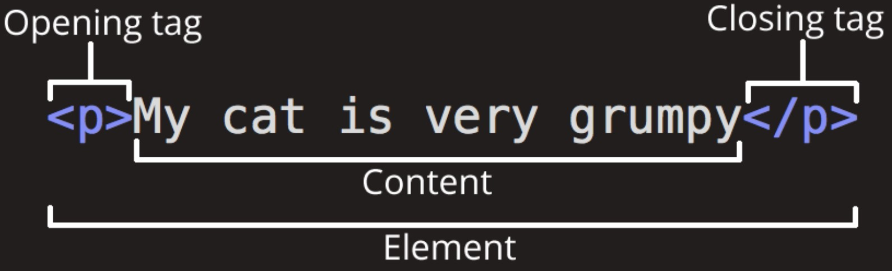

# Elemento HTML
*Componente fondamentale di una pagina web, usato per strutturare e presentare contenuti su Internet.<br>Ogni parte di un sito web, come il testo, le immagini, i link e i pulsanti, è definita da elementi HTML.*

* L' elemento è definito da un tag di apertura, del contenuto e un tag di chiusura.



1. Il tag di apertura: è costituito dal nome dell'elemento (in questo caso, p), racchiuso tra parentesi angolari di apertura e chiusura e indica dove l'elemento ha inizio.

2. Il tag di chiusura: è uguale al tag di apertura, tranne per il fatto che include una barra prima del nome dell'elemento e indica dove l'elemento ha fine.

3. Il contenuto: è il contenuto dell'elemento che dipende dal tag utilizzato.

* L'elemento è definito annidato quando contiene più tag al suo interno.

**Premendo ! e a seguire tasto tab crea un documento html basico.**

```
<!DOCTYPE html>
<html>
  <head>
    <title>Titolo della Pagina</title>
  </head>
  <body>
    <h1>Il mio primo titolo</h1>
    <p>Il mio primo paragrafo.</p>
  </body>
</html>
```

- La dichiarazione \<!DOCTYPE html> definisce che questo documento è un documento HTML
- L’elemento \<html></html> è l’elemento radice di una pagina HTML, tutto quello che è racchiuso al suo interno è HTML.
- L’elemento \<head> contiene informazioni meta sulla pagina HTML
- L’elemento \<body></body> definisce il corpo del documento ed è un contenitore per tutto il contenuto visibile, come titoli, paragrafi, immagini, collegamenti ipertestuali, tabelle, elenchi, ecc.
- L’elemento \<title> specifica un titolo per la pagina HTML (che viene mostrato nella barra del titolo del browser o nella scheda della pagina)
- L’elemento \<h1> definisce un titolo grande
- L’elemento \<p> definisce un paragrafo
- L'elemento \<div> definisce una sezione del paragrafo.


* L'elemento è vuoto se non ha un tag di chiusura. 

### Markup and paragraph

```
<h1>Titolo</h1>

<h2>Sottotitolo</h2>

<h3>Titolo paragrafo</h3>

<strong>grassetto</strong>

<em>bold italic</em>

<p>paragrafo</p>

<div>sezione del paragrafo</div>

<br/> interruzione di riga; elemento vuoto senza tag di chiusura.
```

### Lists
```
<ol id="myListNumber">
  <li>pasta</li> "premere tasto tab per spostarsi e inserire <li> + elemento lista 
  <li>latte</li>
  <li>burro</li>
</ol>

Elenco casuale

<ul id="myList">
        <li>Elemento 1</li>
        <li>Elemento 2</li>
        <li>Elemento 3</li>
        <li>Elemento 4</li>
        <li>Elemento 5</li>
  
</ul>
```


## Images

```
 <figure>
      
      <figcaption>Logo dechainlabs</figcaption>
  </figure>

```
 ## Elementi a blocco
Un elemento a blocco inizia sempre su una nuova riga e i browser aggiungono automaticamente uno spazio (un margine) prima e dopo l’elemento.

Un elemento a blocco occupa sempre l’intera larghezza disponibile (si estende a sinistra e a destra quanto possibile).

### esempi di elementi a blocco
```
<article></article>
```

è un elemento semantico importante per rappresentare un'unità di contenuto indipendente, particolarmente utile per articoli di testo, post di blog, o qualsiasi altra porzione di contenuto che potrebbe essere distribuita e riutilizzata altrove.