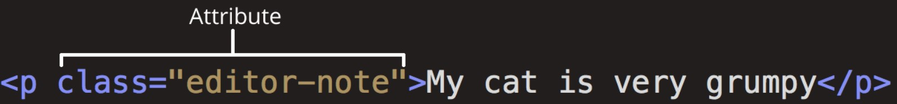

# Hyper text markup language

[Sito ufficiale HTML](https://html.spec.whatwg.org/ "Sito Ufficiale")

[Midali](https://codegrind.it/documentazione/html/elementi)

### Breve storia di HTML

La sua storia inizia negli anni ‘80, quando il fisico inglese Tim Berners-Lee, presso il CERN (Organizzazione Europea per la Ricerca Nucleare), sviluppò un sistema di gestione delle informazioni basato su ipertesti e collegamenti. Nel 1991, venne pubblicata la prima versione dell’HTML con un set limitato di elementi e attributi.

Nel corso degli anni ‘90, l’HTML ha subito diverse revisioni e aggiornamenti, portando alla popolarità della versione HTML 4.01. Successivamente, nel 2014, è stata rilasciata l’ultima versione ufficiale, l’HTML5, che ha introdotto nuovi elementi, attributi e funzionalità per supportare lo sviluppo web moderno, compresi elementi per video, audio, grafica vettoriale e interazioni avanzate.

HTML ha svolto un ruolo cruciale nella crescita e nell’evoluzione del World Wide Web, rendendo possibile la creazione di pagine web interattive e accessibili a milioni di persone in tutto il mondo.

### Introduzione

HTML è il linguaggio di markup standard che descrive la struttura di una pagina web. Consiste in una serie di elementi che indicano al browser come visualizzare il loro contenuto grazie ad etichette che dicono al browser:

- questo è un titolo
- questo è un paragrafo
- questo è un collegamento

Lo scopo di un browser web (Chrome, Edge, Firefox, Safari) è quello di leggere i documenti HTML e visualizzarli correttamente.

Gli attributi contengono informazioni extra sull'elemento.

##### Esempio di HTML

