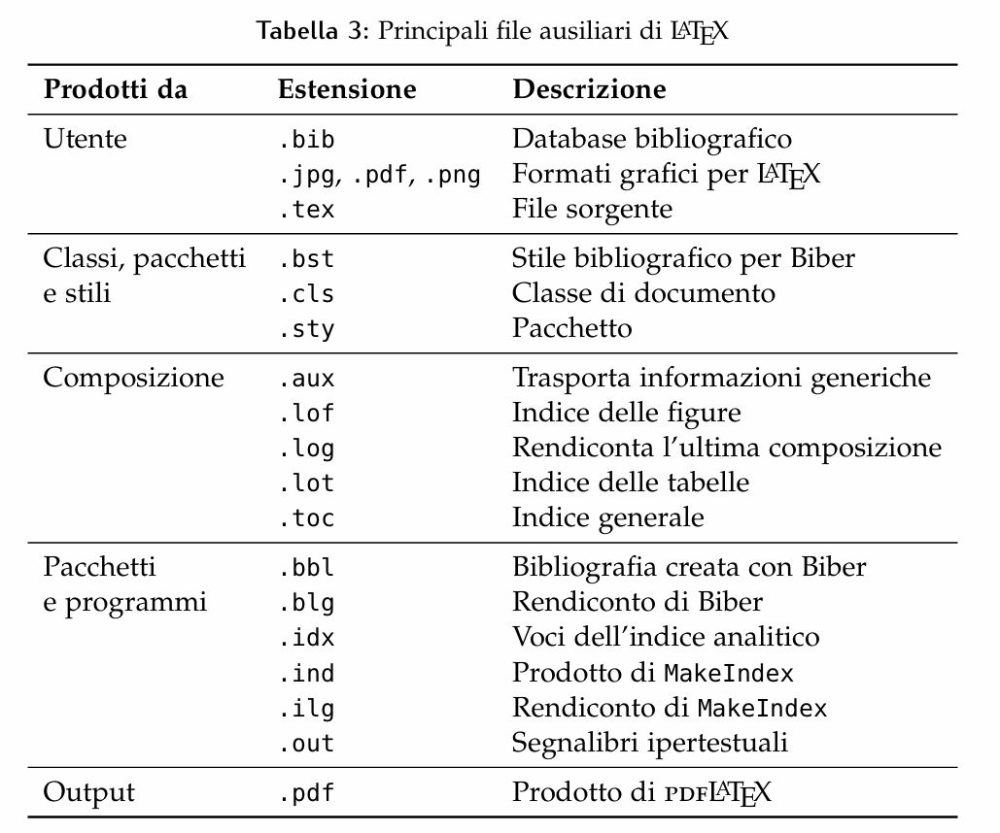
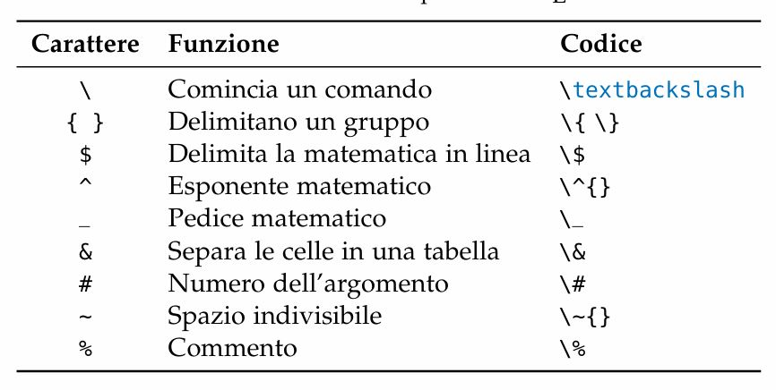

# Scrivere codice
20240923194811

Si crei una cartella nella quale mettere tutti i file del documento. 
Dopo di che, con l’editor scelto si apra un nuovo file e si scriva il seguente codice
```
\documentclass\[a4paper]{article}
\usepackage\[T1]{fontenc}
\usepackage\[utf8]{inputenc}
\usepackage\[italian]{babel}

\begin{document}
Ecco il mio primo documento con \LaTeX.
\end{document} 
```
Infine si registri il file come main.tex (.tex è l’estensione dei sorgenti LATEX)

## Il codice in dettaglio
```
\documentclass\[⟨...⟩]{⟨...⟩}
```
dotazione minima di caratteri (lettere, numeri e pochi altri segni) del tutto sufficiente, per la lingua inglese.


`\documentclass\[⟨...⟩]{⟨...⟩}`
`\usepackage\[T2A,T1]{fontenc}` 
%fontenc si occupa dei font che si vedranno nel documento composto
%T1 è la codifica dei font usati per scrivere in italiano e in molte altre lingue occidentali
`\usepackage\[utf8]{inputenc}` 
%inputenc (input encoding, “codifica di input”) serve a LATEX per interpretare correttamente i caratteri immessi nell’editor.
%utf8 è la codifica di input, in gergo, che permette di scrivere nell’editor i segni di numerosi alfabeti direttamente dalla tastiera, evitando di dover caricare ogni volta la codifica adatta alla lingua del documento.
`\usepackage\[russian,italian]{babel}`
%Il terzo e ultimo pacchetto da caricare sempre è babel, che agisce su parole fisse (cioè le voci generate automaticamente dai comandi raccolti nella tabella 48), date, convenzioni tipografiche e sulla scelta delle regole di sillabazione. L’ ultima dichiarata è la lingua principale del documento.

`\foreignlanguage{⟨lingua⟩}{⟨testo⟩}` 
%per singole parole
```
 \begin{otherlanguage\*}{⟨lingua⟩}
 ... 
 \end{otherlanguage\*}
```
%per porzioni di testo si usi l' ambiente otherlinguage

T2A per un documento in italiano e russo
`\usepackage\[T2A,T1]{fontenc}` %per scrivere in russo e italiano

## Compilare il codice
Cliccando sul punsante compila LaTex il codice .tex, lavorando “dietro le quinte”. 
La composizione non è dunque semplicemente “il tempo che bisogna attendere per vedere il pdf”, ma il processo durante il quale il programma comprende le intenzioni dell’utente (espresse con i comandi), e le trasforma in un file (tipo)grafico.
Guardando nella cartella di lavoro dopo la prima compilazione si noterà che oltre al file .tex iniziale *il file sorgente,* e aagli eventuali file esterni come le immagini ce ne sono altri: sono i file ausiliari prodotti dalla composizione. Il loro numero dipende dalla complessità del documento, ma è importante sapere che a parte il file .bib non vanno toccati: LATEX li crea e se ne serve automaticamente.



## Comandi e ambienti

Latex e un comune programma di videoscrittura a composizione sincrona  presentano per certi versi un funzionamento simile: entrambi ricevono dall’utente sia il testo sia le istruzioni per impostarne l’aspetto.
Il programma sincrono nasconde i comandi mostrandone solo gli effetti; Latex rende visibili i comandi portandoli in suerfice insieme al testo.

### il comando
Istruzione che ordina a LATEX di trattare in un certo modo una porzione più o meno ampia di testo. 
Si possono classificare per.
1. forma
    * carattere non alfabetico: spazio , tilde ~, circonflesso ^ e trattino basso \_.
    * Una barra rovescia \ seguita da un solo carattere non alfabetico.
    * ```
      \{...}
      \%
      \$
      \_
      \&
      \#
      \~
      ```
    * Una barra rovescia \ seguita da una sequenza di caratteri alfabetici.

```
\LaTeX
\item\[...]
\emph{...}
\documentclass\[...]{...}
\subfloat\[...]\[...]{...}
\pdfbookmark\[...]{...}{...}
\multicolumn{...}{...}{...}
```
* Comandi come `\textit{⟨testo⟩}` ordinano a LATEX di trattare in un certo modo solo il ⟨testo⟩ scritto tra le parentesi graffe.
* Comandi come `\itshape`, detti dichiarazioni, ordinano a LATEX di trattare in un certo modo tutto il testo successivo al punto in cui vengono dati.
** la dichiarazione  imposta uno o più aspetti generali della composizione, e può essere data: **
      * nel preambolo, e allora ha effetto sull’intero documento e si annulla soltanto con un’altra dichiarazione.
      * nel corpo del documento, e allora va data in un gruppo (cioè una porzione di testo racchiusa di solito da parentesi graffe o comandi di inizio e fine ambiente).


	
### l'ambiente
Porzione di codice delimitata da un comando d’apertura e uno di chiusura.
```
\begin{⟨ambiente⟩}\[⟨...⟩]{⟨...⟩}
 ...
\end{⟨ambiente⟩}
```

## Nota
Nota a margine
` \marginpar{⟨testo della nota a margine⟩}`

Nota a piè di pagina
`\footnote{⟨testo della nota a piè di pagina⟩}`
la loro numerazione riprende a ogni \chapter o \section

Riferimento simbolico a sostituire il numerico
`\renewcommand{\thefootnote}{\fnsymbol{footnote}}`

## Evidenziare con il corsivo
`\emph{⟨testo⟩}`


