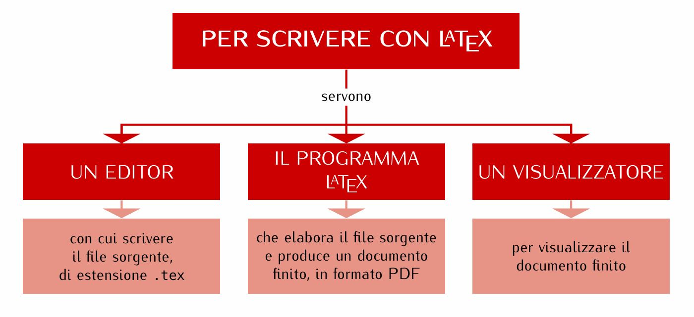

 *Abbiamo visto che la programmazione è un’arte,
 perché richiede conoscenza, applicazione, abilità e ingegno,
 ma soprattutto per la bellezza degli oggetti che produce.*
 – Donald Ervin Knut

 ## la nascita di Tex
 LATEX è un programma di composizione tipografica liberamente disponibile, indicato soprattutto per scrivere documenti scientifici con la più alta qualità,  realizzato da Donald Ervin Knuth, professore di Informatica all’Università di Stanford (usa), e distribuito con una licenza di software libero.

 Nel 1977, Knuth cominciò a scrivere il suo “motore” di tipocomposizione per esplorare le potenzialità degli strumenti di stampa digitale che allora cominciavano a muovere i primi timidi passi in campo editoriale.  Il programma ha visto la luce nel 1982. 

TEX si pronuncia tèch (aspirando il ch finale).  Knuth dice che «se TEX è ben pronunciato, lo schermo del calcolatore si appanna leggermente».

## la nascita di LaTex
LATEX è un programma di composizione tipografica realizzato da Leslie Lamport e liberamente disponibile, che usa TEX come motore di tipocomposizione. La prima versione pubblica di LATEX risale al 1985.
### filosofia di LaTex
1.composizione asincrona
il testo viene digitato in laTex editor concentrandosi unicamente su struttura logica e contenuto del documento (senza perciò preoccuparsi di come apparirà), per darlo “in pasto” successivamante a Tex.  L'utente si concentra sul cosa; sul come ci pensa LaTex e il motore Tex.
2. istruzioni di marcatura
ogni parte del testo ha un suo ambiente definito dal comando, l'istruzione di marcatura del testo.

