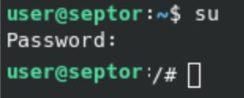
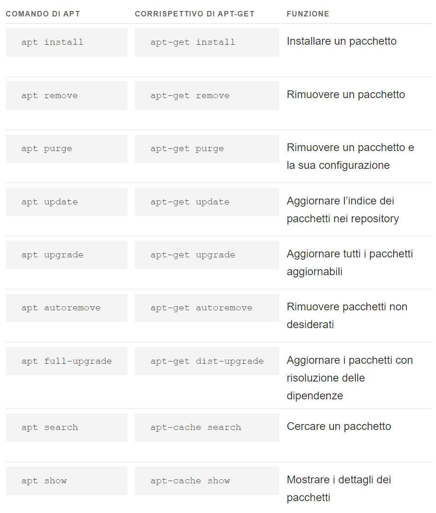
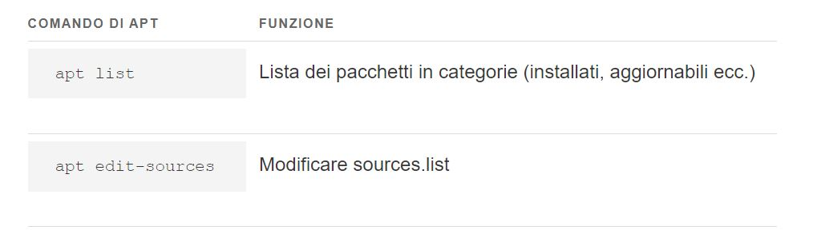

Per avere la conferma di essere nella cartella /home/mario/ è utile eseguire il comando pwd, il quale stamperà a schermo il percorso corrente. Digitare il seguente comando:

pwd
Gestione di file e directory

* pwd
Il comando pwd serve per mostrare la directory in cui ci si trova.

* ls
Il comando ls serve per elencare il contenuto di una directory.

La sintassi del comando è:  ls [opzione] [directory]

* cd

Il comando cd serve per spostarsi all'interno delle directory del filesystem.

La sintassi del comando è:  cd [directory]

Spostarsi alla directory superiore 
cd .. 
Spostarsi da qualsiasi punto nella propria directory home: 
cd 
Spostarsi nella directory /etc: 
cd /etc

* mkdir

Il comando mkdir serve per creare directory all'interno del filesystem.

La sintassi del comando è: mmkdir [opzioni] directory

Creare la directory prova/ all'interno della directory corrente: 
mkdir prova

Creare la directory prova all'interno della propria home directory, qualunque sia la directory in cui ci si trova al momento: 
mkdir ~/prova

* cp

Il comando cp serve per:

copiare un file in un altro file; 
copiare un file in un'altra directory; 
copiare più file in un'altra directory; 
copiare directory. 
La sintassi del comando è la seguente:

cp [opzioni] origine destinazione

Copiare il file miofile della directory prova nella directory /prova1: 
cp /prova/miofile /prova1

Copiare il file miofile della directory /prova nella directory /prova1 dandogli il nome nuovofile: 
cp /prova/miofile /prova1/nuovofile

Copiare la cartella /prova, e tutto il suo contenuto, nella cartella /prova_copia: 
cp -r /prova /prova_copia

## mv

Sintassi 
$ mv [opzione] [origine] [destinazione]

Il comando mv di Linux ha due funzioni importanti. 

 1) In primo luogo, viene utilizzato per spostare i file da una directory a un’altra, ma può anche essere usato per spostare le directory stesse. 
 
 2) Una seconda possibile funzione del comando è quella di rinominare dati o cartelle. 

  Ci sono due modi possibili per farlo:

  1)  richiamare prima la directory di origine con il comando cd di Linux e spostate il file da lì a una directory di destinazione 

  $ mv clienti.txt ~/documenti/contatti/

  2)  memorizzate la directory di origine nel comando stesso ed eseguire il trasferimento da un’altra directory di lavoro.

  $ mv /home/fatture/clienti.txt /documenti/contatti/

  Esistono tre opzioni per mv:

 * -i o –interactive: questa opzione fa sì che il sistema chieda se un file o una directory devono essere sovrascritti.
* -u o –update: con questa opzione un file di origine viene spostato solo se quello di destinazione è più vecchio.
* -v o –verbose: questa opzione mostra il progresso durante lo spostamento.

Esempi di comando mv:

* mv *.txt /documenti/  sposta tutti i file .txt

* $ mv clienti.txt clienti_nuovi.txt rinomina il file

* $ mv fatture fatture_vecchie rinomina la cartella

* $ mv /fatture_vecchie /archivio  sposta la directory fatture_vecchie nella directory archivio

## sudo

Viene utilizzato su linux per eseguire quello specifico comando e solo quello  con i privilegi di sicurezza di un altro utente, solitamente l' utente root che è l'amministratore del sistema.

la sua sintassi è 
sudo -u [utente] [comando]

Quando viene utilizzato senza specificare un utente utilizza di default l'utente root.

sudo [comando] 
che corrisponde a 
sudo -u root [comando]

Se sulla riga comandi digito il comando su , premo invio e poi digito la password dell'utente root, allora diventerò utente root e qualsiasi comando sarà fatto come tale.

per ritornare a utente normale 
su [nome_utente]

## APT
APT (Advanced Packaging Tool) è un potente sistema di gestione di pacchetti. Per eseguire APT richiede i privilegi d'amministrazione.

Con Ubuntu 16.04 LTS è stato introdotto il  comando apt.
Qual è la differenza fra i comandi apt-get e apt. 

Debian (la “mamma” delle tantissime distribuzioni GNU/Linux basate su Ubuntu e sulla stessa Debian), per gestire il proprio sistema di pacchettizzazione dpkg, ha adottato un set di strumenti chiamato Advanced Packaging Tool (APT) (da non confondere con il comando apt, che non è esattamente la stessa cosa). Come forse già saprete, esistono vari tool per gestire i pacchetti, sia con interfaccia grafica che a riga di comando: Ubuntu/GNOME Software, Synaptic, Aptitude, apt-get e apt-cache.

Apt integra un insieme di funzioni che hanno sostituito in gran parte quelle di apt-get e apt-cache, fornendo i comandi necessari per la gestione dei pacchetti.

https://manpages.debian.org/jessie/apt/apt.8.en.html

Con apt è possibile trovare in un solo posto tutte le funzionalità necessarie, senza perdersi in lunghi elenchi di opzioni e parametri. apt ha meno opzioni ma organizzate in maniera più funzionale.

## Echo

Viene utilizzato per stampare del testo o variabili sul terminale. È utilizzato spesso in script e nel terminale per visualizzare messaggi, contenuti di variabili, o anche per creare file di testo.

echo "Ciao, mondo!" > fabiofile.txt
 crea il file fabiofile e scrive al suo interno ciao, mondo

 ## Touch

 crea un file 

 touch fabiofile.txt

## Cat

mostra il contenuto del file

cat fabiofile.txt

## ls

Viene utilizzato per elencare i file e le directory presenti in una directory. Il comportamento del comando ls può essere personalizzato utilizzando diverse opzioni e variabili

ls -l   Mostra i dettagli dei file in formato lungo (long listing format), inclusi i permessi, il numero di link, il proprietario, il gruppo, la dimensione del file e la data di modifica.

ls -a Mostra tutti i file, inclusi quelli nascosti.

ls -h Mostra le dimensioni dei file in un formato leggibile

ls --color   Aggiunge colore ai file in base alla tipologia di file.

Alias e variabili di ambiente:
Puoi anche creare alias per il comando ls per personalizzare il comportamento predefinito. Ad esempio:

alias ls='ls --color=auto -h'

## useradd
Creare un nuovo utente con il nome nomeutente:

sudo useradd -m -s /bin/bash [nomeutente]

* -m: Crea la directory home per l'utente (solitamente in /home/nomeutente).
* -s /bin/bash: Specifica la shell di login predefinita per l'utente (in questo caso, bash). Puoi scegliere una shell diversa se lo desideri.
* nomeutente: Sostituisci questo con il nome dell'utente che vuoi creare.

 Impostare una password:

sudo passwd [nomeutente]

Impostare permessi amministrativi aggiungendo al gruppo sudo:

sudo usermod -aG sudo [nomeutente]

-aG sudo: Aggiunge l'utente al gruppo sudo, consentendogli di eseguire comandi come amministratore utilizzando sudo.

Cambiare utente

su - [nomeutente]

* rm e rmdir

Il comando rm serve per cancellare file o directory dal file system.

La sintassi del comando è: rm [opzioni] file ...
Alcune opzioni da utilizzare con il comando rm:

-i, chiede conferma prima di cancellare 
-f, forza la cancellazione del file senza chiedere conferma

Il comando rmdir serve per cancellare directory dal file system.

La sintassi del comando è: rmdir directory

Cancellare il file miofile: 
rm miofile

Cancellare la directory prova/ e tutto il suo contenuto: 
rm -rf prova/

Cancellare la directory prova/ solo se questa non contiene alcun file all'interno: 
rmdir prova/

Bibliografia: 
[Wiki_Ubuntu](https://wiki.ubuntu-it.org/AmministrazioneSistema/ComandiBase) 
[Permessi_File](https://wiki.ubuntu-it.org/AmministrazioneSistema/PermessiFile#chmod)