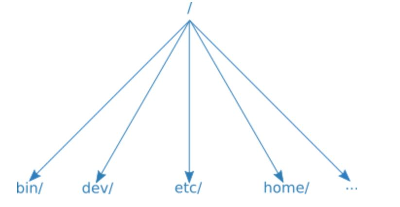
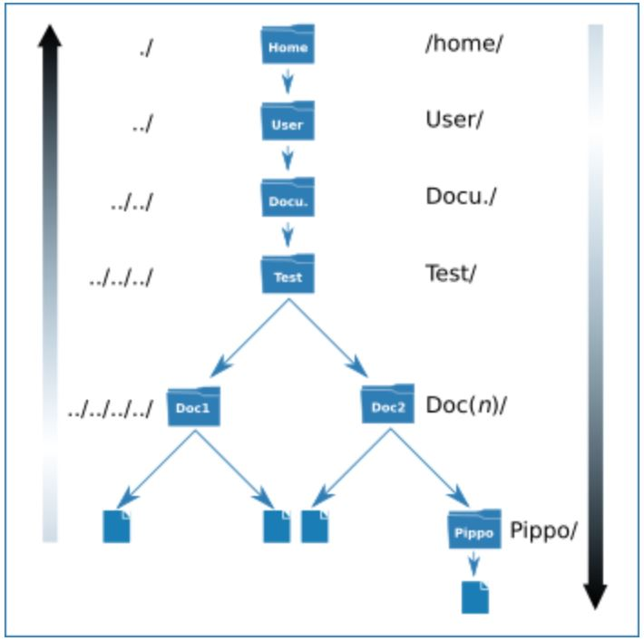

## Filesystem linux 
Parte tutto dal / ed è  paragonabile ad un albero rovesciato che ha come radice il root / e si dirama verso le directory

Per muoversi nel filesystem di linux dobbiamo seguire un percorso o path.
Esistono due tipi di path:

* Il percorso assoluto o completo, parte dall'inizio e mostra il percorso completo del file o directory.
Parte quindi  dalla directory root (/) di linux e si snoda attraverso il filesystem.

/home/gian/Documenti/Test/Doc1

* Il percorso relativo o incompleto, relativo alla posizione in cui ci troviamo,
Parte dalla directory in cui ci troviamo (relativamente ad essa per l’appunto) e sale o scende lungo il filesystem.

./ 

In sostanza se un percorso inizia con lo slash (/) è assoluto,  se inizia con dot (.) è relativo.

pwd è il comando che mi dice dove mi trovo attualmente.

Finora ci siamo mossi linearmente ma come sappiamo i percorsi si possono fare alquanto tortuosi ad esempio potremmo doverci muovere da una directory ad un’altra che si trova allo stesso nostro livello o anche più basso ma che si dirama da altra directory; basta salire con il doppio punto (../) e spostarsi e/o scendere con slash (/).

Se ad esempio dal terminale volessimo raggiungere la directory Pippo per accedere al documento in esso contenuto e ci trovassimo in Doc1 dovremmo scrivere ../ per raggiungere Test quindi Doc2/ e Pippo/Documento di Pippo.

../Doc2/Pippo/Documento.txt 

## Le cartelle . e ..
Sono presenti in ogni directory 
. indica la direcoty dove mi trovo
.. la directory precedente