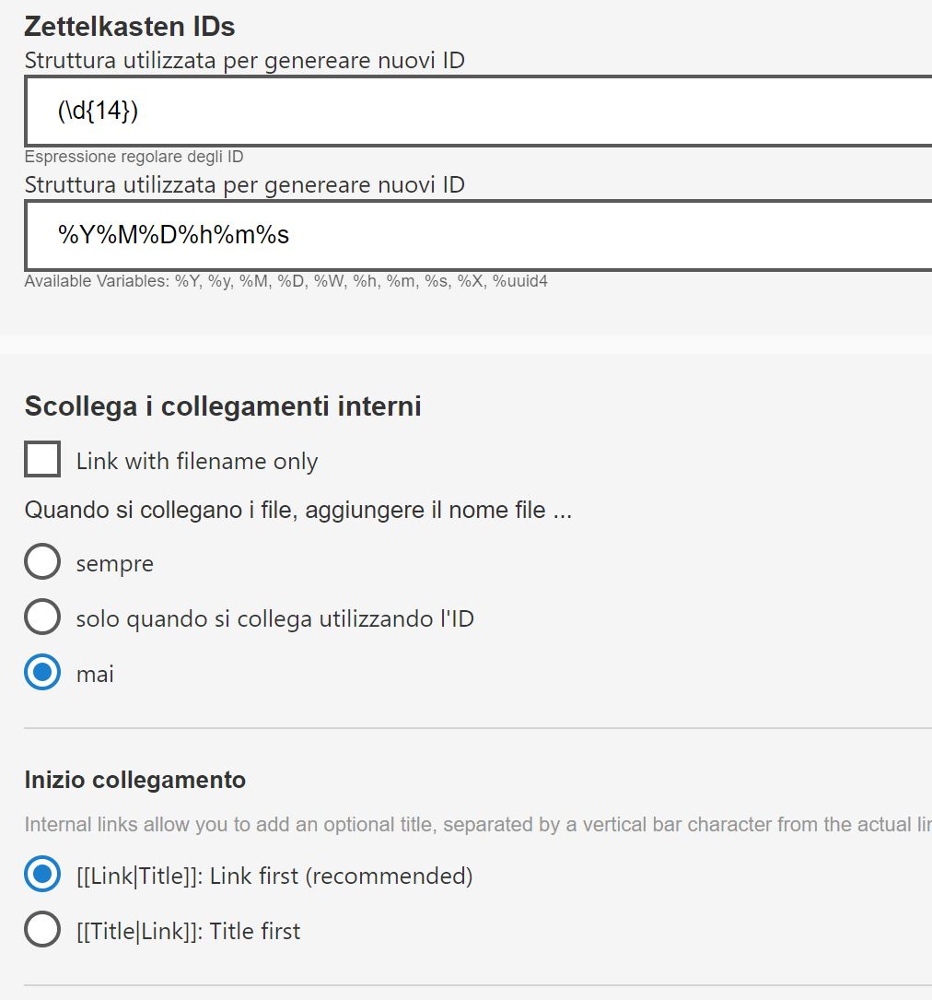

# Scrivere Markdown
20240914222920
## Titoli
# titolo 1 
## titolo 2
### titolo 3


## Italic-Bold-Italic Bold
*italic*
**bold**
***italic-bold***

## Blockquote
```
> This is a blockquote
> put a `>` before every line or you can let your lines get really long and wrap on their own.

> I love Markdown
>
>> I love Markdown twice
```

## Nota a piè di pagina
``Ctrl+Alt+F`` inserisce una nota[^1]
`` Ctrl+ click su nota`` modifica la nota


## Emoji
😁  ``tasto window + tasto punto``

## Blocchi di codice
Backtick >con tastiera inglese tasto a sx di 1>
```html
<!DOCTYPE html>
<html lang="it">
<head>
    <meta charset="UTF-8">
    <meta name="viewport" content="width=device-width, initial-scale=1.0">
    <title>La mia prima pagina HTML</title>
</head>
<body>
    <h1>Ciao, Mondo!</h1>
    <p>Questa è la mia prima pagina web scritta in HTML.</p>
    <p>Visita il <a href="https://www.example.com">mio sito preferito</a> per maggiori informazioni!</p>
</body>
</html>


```

## Evidenziare testo
Backtick >con tastiera inglese tasto a sx di 1>
``CIAO``
==hbmhkjb==

## Apice e Pedice
x^2^
H~2~O

## Liste
In Markdown, puoi creare due tipi di liste: **liste non ordinate** (puntate) e **liste ordinate** (numerate).
```
1. ciao
    1. premo tab per avanzare di uno spazio
    2. ririciao

- Primo elemento
- Secondo elemento
  - Sotto-elemento (indentato)
  - Altro sotto-elemento
- Terzo elemento

```

## Link a pagina web titolo
```
[Click me!](http://test.com/ "Link to Test.com")
```
## Link a mail
<fabio@gigi.com>
## Immagine
Zettlr non mostra nello spazio di lavoro file che non siano file di testo
Per inserire l'iimagine devo scrivere il percorso relativo a mano o copiarlo usando un altro file manager.


## Usare i caratteri di formattazione
```
I want to type *this text surrounded by asterisks* but I don't want it to be
in italics, so I do this: \*this text surrounded by asterisks\*.
\#   \[]
```
## Commenti nascosti
In Markdown, ***non esiste un supporto nativo per i commenti nascosti*** che non vengano renderizzati nel documento finale. Tuttavia, puoi usare alcune soluzioni per aggiungere commenti nascosti.
```
<!-- Questo è un commento nascosto che non verrà visualizzato nel docu finale -->

```
## linee orrizzontali
------
*****

## Spazio tra paragrafi
Ciao mondo1.<br>Ciao mondo 2
<p>Ciao mondo1.</p>Ciao mondo2.

## Link Utili
[Markdown Syntexx](https://www.markdownguide.org/basic-syntax/)
[Scorciatoie zettlr](https://docs.zettlr.com/it/reference/shortcuts/)
[Ricerca Zettlr](https://docs.zettlr.com/it/core/search/)
[Tabelle Zettlr](https://docs.zettlr.com/it/core/tables/)
[Markdown tools](https://www.markdownguide.org/tools/)
[John Gruber's Markdown documentation](https://daringfireball.net/projects/markdown/)
[Commonmark](https://spec.commonmark.org/0.28/)
[Learnxinyminutes](https://learnxinyminutes.com/docs/markdown/)
[Markdown tables generator](https://www.tablesgenerator.com/markdown_tables)
[Github flowered markdown](https://github.github.com/gfm/)
I love [Github pages](https://pages.github.com/)

## Il metodo Zettlekasten
[Il metodo](https://docs.zettlr.com/it/guides/guide-zettelkasten/)

Rete di note interconnesse.<br>E' un sistema avanzato per prendere gli appunti e organizzare le conoscenze che si distingue per la sua capacità di stimolare il pensiero critico, la creatività e la comprensione profonda.

Il metodo si basa sull’uso di singole note o schede, ciascuna contenente un’idea, un concetto o un pezzo di informazione specifico. Queste note sono poi interconnesse in un sistema reticolare che riflette le relazioni e i collegamenti tra le varie idee. Invece di seguire un ordine lineare o gerarchico, come in un tradizionale quaderno di appunti, il Zettelkasten incoraggia la creazione di una rete di note interconnesse.

Ogni nota nel sistema ha un suo numero unico e può essere collegata ad altre note tramite riferimenti incrociati. Questo approccio permette di navigare facilmente tra argomenti correlati, facilitando la scoperta di nuove connessioni e la costruzione di una comprensione più olistica del materiale di studio.

1. **Crea la nota**. Quando trovi un’idea o un concetto chiave "di cosa parla il testo" durante lo studio, scrivi una nota. Assicurati che ogni nota sia comprensibile anche se letta indipendentemente dalle altre.
2. **Assegna un codice unico**. Ogni nota riceve un codice unico. Questo può essere un numero sequenziale o un sistema più complesso basato su categorie o argomenti. Il codice facilita il riferimento incrociato tra note;
3. **Fai collegamenti incrociati.** Quando scrivi una nota, considera come si collega ad altre note nel tuo Zettelkasten. Aggiungi riferimenti ai codici delle note correlate. Questo crea una rete di informazioni interconnesse che riflette le relazioni tra vari concetti;
4. **Revisiona e aggiorna le note.** Rivedi regolarmente le tue note, aggiungendo nuovi collegamenti o aggiornando le informazioni. Questo processo di revisione serve per mantenere vivo il sistema e stimola nuove idee e connessioni;
[Il metodo](https://docs.zettlr.com/it/academic/zkn-method/)

### I Tags
#howto.. questo è un tag

### L' Id univoco
- Aggiungere un ID nel contenuto della nota 
```
202409121530 genera id con i tasti Ctrl + l
e aggiungo il mio tag
#howto
```
- Collegare il file tramite id con i wikilink
```
[[202409121530]]
[[20240914222123|testo del link]]
```
[[20240914222123]]
[[20240914222123|testo]]

#### Ricerca dell'ID
Zettlr prende il primo ID e basta, quindi, la primissima cosa nella nota è l'Id.
Se premi ``Ctrl e clicchi sul wikilink`` si avvia il motore di ricerca che troverà tutti i file dove  l id è contenuto.
Zettler non usa nella sua ricerca l'ID formattato come collegamento interno.



cosa è Zettalkasten


[^1]: this is a blockquote

